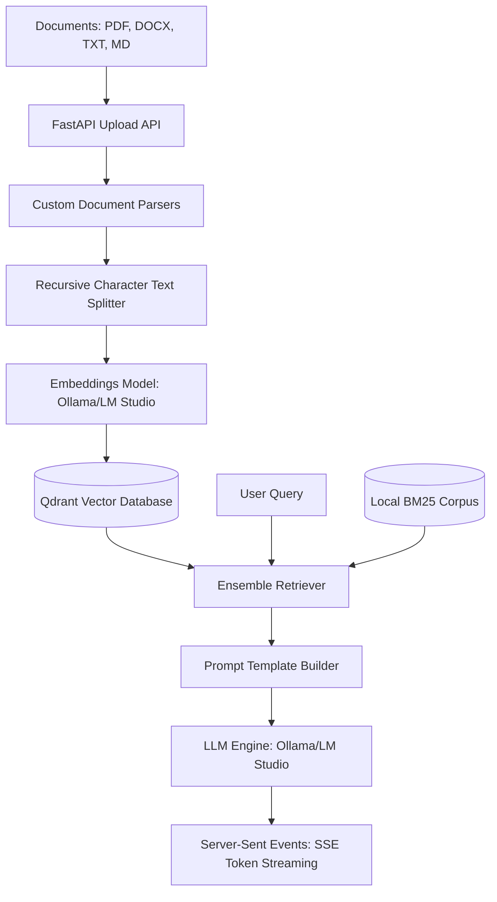

# RAGBuilder

RAGBuilder is a high-performance, local-first framework designed for building, optimizing, and deploying custom Retrieval-Augmented Generation (RAG) pipelines. Powered by **FastAPI**, **LangChain**, and **Qdrant**, it enables developers to create specialized chat assistants using local models running on **Ollama** or **LM Studio**.

---

## 🛠 Architecture Overview

RAGBuilder separates document processing, context retrieval, and model execution into modular, local-first stages:



### Key Components:
* **Relational Storage:** SQLite (`ragbuilder.db`) stores configuration, bot metadata, document indexing references, and stateful chat session history.
* **Vector Storage:** Qdrant (`qdrant_db/`) manages high-dimensional embeddings and executes vector search.
* **Retrieval Engine:** Combines dense vector searches with sparse lexical queries (BM25) via a custom `EnsembleRetriever` implementation.

---

## 🚀 Key Features

* **Local-First Processing:** Runs end-to-end on your local machine using Ollama or LM Studio endpoints—no data leaves your local environment.
* **Hybrid Retrieval:** Merges Qdrant vector similarity with rank-based lexical keyword matching (BM25) using a weighted ensemble ($0.7$ vector / $0.3$ keyword) for high retrieval precision.
* **Robust File Ingestion:** Custom parsing modules handle text, markdown, PDF, and DOCX files automatically.
* **Streaming Responses:** Built-in Server-Sent Events (SSE) support for real-time token streaming using FastAPI and LangChain `astream`.
* **System Stats & Monitoring:** Exposes endpoints to monitor CPU, RAM, Disk, database sizes, file descriptors, and system logs in real-time.

---

## 📥 Getting Started

### Prerequisites
* **Python:** 3.10 or higher.
* **Node.js & npm:** For the frontend application.
* **Local LLM Engine:** Ollama running on `http://127.0.0.1:11434` or LM Studio running on `http://127.0.0.1:1234`.

### Installation

1. **Clone the Repository:**
   ```bash
   git clone <repository-url>
   cd RAGBuilder
   ```

2. **Set Up the Python Virtual Environment:**
   ```bash
   python3 -m venv .venv
   source .venv/bin/activate
   pip install -r requirements.txt
   ```

3. **Install Frontend Dependencies:**
   ```bash
   cd frontend
   npm install
   cd ..
   ```

---

## ⚙️ Running RAGBuilder

A start script (`start.sh`) is provided in the project root to spin up both the backend and frontend servers concurrently:

```bash
chmod +x start.sh
./start.sh
```

### Server Endpoints:
* **Frontend UI:** [http://localhost:3000](http://localhost:3000)
* **Backend API Documentation:** [http://localhost:8000/docs](http://localhost:8000/docs)

---

## 🔌 API Documentation Highlights

### 1. Bot Configurations
* **`POST /api/bots`:** Create a new custom bot.
  ```json
  {
    "name": "Local Assistant",
    "description": "Custom developer RAG model",
    "provider": "ollama",
    "api_url": "http://127.0.0.1:11434",
    "llm_model": "llama3",
    "embedding_model": "nomic-embed-text",
    "search_technique": "hybrid",
    "chunk_size": 500,
    "chunk_overlap": 50,
    "system_prompt": "You are a helpful programming assistant.",
    "temperature": 0.2
  }
  ```

### 2. Document Ingestion
* **`POST /api/bots/{bot_id}/documents`:** Upload and index a document (accepts file form-data). Splits text using `RecursiveCharacterTextSplitter` and embeds chunks directly into the bot's Qdrant vector collection.

### 3. Streaming Chat
* **`POST /api/bots/{bot_id}/chat`:** Streams markdown response tokens using Server-Sent Events (SSE). Sends a `metadata` event first containing retrieved chunk contents and sources, followed by sequential `token` events.

---

## 📊 Directory Structure

```text
RAGBuilder/
├── frontend/             # Next.js Frontend Application
├── lib/                  # Backend Application Core Modules
│   ├── db.py             # SQLite Schemas & DB Helpers
│   ├── providers.py      # LLM & Embedding Integrations (Ollama, OpenAI/LM Studio wrappers)
│   └── rag.py            # Chunking, Qdrant Ingestion & Hybrid Retrieval
├── main.py               # FastAPI Core Server & System Endpoints
├── qdrant_db/            # Local Persistent Qdrant Storage (Generated)
├── requirements.txt      # Python Dependencies
├── start.sh              # Unified Server Bootstrapper
└── ragbuilder.db         # Persistent SQLite File (Generated)
```

---

## ⚖️ Development & Tuning

### Adjusting Chunk Parameters
In the bot creation payload (or edit form), you can tune the retrieval performance:
* **`chunk_size`:** Controls the window size of extracted segments. Default is `500` characters. Larger sizes capture more context but dilute vector accuracy.
* **`chunk_overlap`:** Controls character overlap between adjacent chunks. Default is `50` characters. This prevents context fragmentation at boundaries.

### Tuning Retrieval Scoring
Under `lib/rag.py`, the hybrid search weights are set as:
```python
ensemble = EnsembleRetriever(
    retrievers=[vector_retriever, bm25_retriever],
    weights=[0.7, 0.3]
)
```
You can fine-tune the `weights` array to change the balancing between semantic vector lookup (0.7) and keyword density (0.3).
